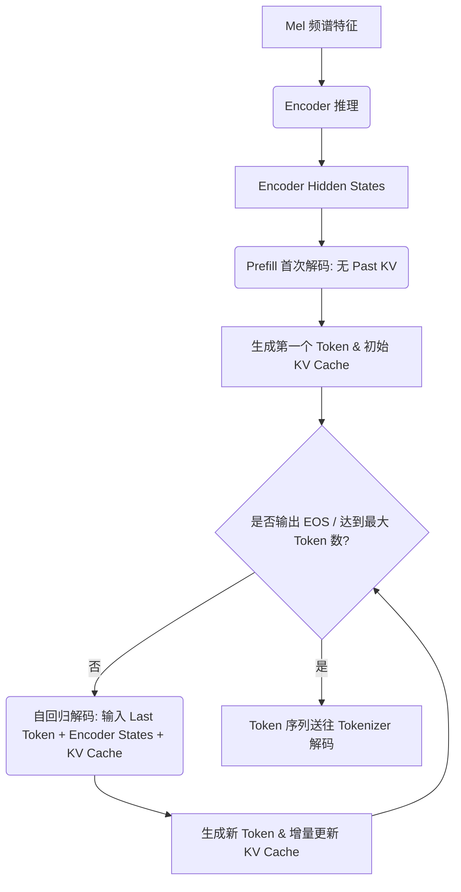

# ONNX Runtime (ort) vs. sherpa-onnx 技术对比与实现解析

在本项目 `octopus` 中，ASR（自动语音识别）推理引擎并未采用 `sherpa-onnx` 等上层开箱即用的框架，而是直接使用 `ort` (ONNX Runtime Rust binding) 作为唯一的模型运行期框架。

这意味着我们需要在 Rust 业务层手工实现从原始音频信号处理、神经网络状态迭代、流式滑动窗口缓存，到后处理 CTC 解码以及 Token 映射的所有底层细节。

本篇文档系统梳理了项目在核心工程环节的实现现状，并与 `sherpa-onnx` 框架的底层处理机制进行了比对。

---

## 1. WAV 音频解析、采样率统一与归一化

在神经网络模型中，音频波形必须对齐到固定的采样率（通常是 16kHz）和振幅范围（归一化至 `[-1.0, 1.0]`）。

| 环节 | `octopus` 实现细节 | 对比 `sherpa-onnx` |
| :--- | :--- | :--- |
| **WAV 文件解析** | 使用 `hound` 库读取并解析标准 WAV 音频文件（支持 Int/Float 音频帧解码）。 | 使用内部 C++ IO 或相关绑定进行波形读取。 |
| **振幅归一化** | 若音频为 i16 编码，显式执行 `s as f32 / i16::MAX as f32` 转换到 `[-1.0, 1.0]` 浮点区间；Float 格式则直接读取。 | 内部使用相似的归一化方式（将时域振幅缩放到浮点数）。 |
| **采样率对齐** | 引入 `rubato` 库中的 `FftFixedIn` 重采样器，动态把非 16kHz 音频重新采样到 16kHz。 | 内部集成了 Kaldi 风格的时域重采样算法。 |
| **流式重采样** | 设计了 `AudioResampler` 结构体，内部引入了一个可变 `buffer`。在每次输入音频流时累积样本，仅当达到重采样器需要的 `input_frames` 整数倍时才执行重采样，并在下一次输入前保留剩余的残差样本。 | 内部通过维护 C++ 状态缓存来实现流式边界对齐。 |

> [!NOTE]
> `octopus` 基于 FFT 窗口的分段重采样算法，能够保证在流式音频切片输入时重采样边界的时域连贯性，防止由于分包边界硬截断引起的系统爆音或高频毛刺，其重采样音质与 `sherpa-onnx` 底层等价。

---

## 2. Fbank 梅尔频谱、帧堆叠、归一化预处理

不同的 ASR 神经网络（如 SenseVoice, Whisper, Paraformer 等）对输入特征有不同的格式与维度要求。

| 环节 | `octopus` 实现细节 | 对比 `sherpa-onnx` |
| :--- | :--- | :--- |
| **梅尔频谱计算** | 采用纯 Rust 编写 Fbank 提取器（基于 `rustfft` 计算功率谱，并通过 Hann/Hamming 窗加窗、计算 80 维或 128 维梅尔滤波器组矩阵的积分）。 | 底层集成并调用 `kaldi-native-fbank` 静态库进行特征提取。 |
| **帧堆叠 (LFR)** | 针对部分声学模型（如 SenseVoice, Paraformer），在 `apply_lfr` 算子中实现了低帧率（Low Frame Rate）帧堆叠。通过滑动窗口 `window_size = 7` 和步长 `window_shift = 6`，将 80 维的 Fbank 矩阵拼接堆叠为 `7 * 80 = 560` 维特征向量。 | 内部由 `Fbank` 提取层内置堆叠配置自动生成。 |
| **特征归一化** | 针对不同模型分别实现： 1. 对数 Fbank：`(sum + 1e-10).ln()` ； 2. Whisper-style 归一化：将 log10 特征乘以对数幅度并缩放至 `[v.max(max_val - 8.0) + 4.0] / 4.0`。 | 在 Fbank 推理链路中内置了对应模型的全局均值方差归一化（CMVN）算子。 |

---

## 3. 长音频分块与流式滑动窗口缓存历史帧

流式语音识别的关键在于对特征流（Fbank 帧）的窗口历史缓存以及声学模型状态（State）的多轮循环传递。

| 环节 | `octopus` 实现细节 | 对比 `sherpa-onnx` |
| :--- | :--- | :--- |
| **滑动窗口历史特征** | 引入 `feat_cache` 缓冲区。以 Paraformer 为例，利用包含 `LEFT_CHUNK_SIZE` (5 帧) 和 `RIGHT_CHUNK_SIZE` (3 帧) 的重叠窗口，在每轮推理时拼接特征为 `[cache \| chunk]`，并在推理后将最新的 8 帧更新回 `feat_cache`。 | 由 C++ 端 `OnlineStream` 内部自动维护特征上下文的环形缓冲区。 |
| **声学模型隐状态** | 每一轮 ONNX `session.run` 时，将上一轮计算并导出的 `cif_alpha`、`cif_peaks` 以及 Decoder 状态张量（`states`）作为当前步的 `ort` Input 循环送入模型，完成增量推理。 | C++ 对象的成员变量在内存中隐式保管着模型的 States 句柄。 |

---

## 4. Encoder-Decoder 多轮迭代循环推理

对于 Whisper 和 Qwen3-ASR 这类主流的非自回归 Encoder + 自回归 Decoder 架构，需要设计高效的序列循环生成器。

*   **`octopus` 的实现**：
    1.  **Encoder 推理**：特征一次性喂给 `encoder_session`，获取 `encoder_hidden_states`。
    2.  **Prefill 解码**：注入诸如 `<|startoftranscript|>`、`<|transcribe|>`、指定语种等特殊标记作为 Prompt 引导，调用 `dec_init` 执行单步前向计算，捕获首个 token 概率并分配 KV 缓存。
    3.  **循环生成**：最大循环迭代 `448` 或 `512` 轮。使用 `ort::inputs!` 将当前 Token 序列端点值与 Past KV Cache 绑定传给 `dec_past` 模型，产出增量 KV Cache 与下一个 token。
*   **对比 `sherpa-onnx`**：
    *   `sherpa-onnx` 在 C++ 中对整个自回归采样（Greedy / Beam Search）进行了硬编码封装。
    *   在 `octopus` 纯 Rust 实现中，我们在自回归解码的热通道中，通过将 KV Cache 的输入键名在 `new()` 初始化时利用 `Box::leak` 预分配为 `&'static str`（免去了每一步格式化层号字符串的堆分配），达成了非常可观的 CPU 推理性能。

---

## 5. CTC 贪心解码与 Token 映射

*   **`octopus` 的实现**：
    1.  **CTC 贪心解码（以 SenseVoice 为例）**：从模型 logits 输出 `[1, n_time, vocab]` 中，在每个时间片 $t$ 取 argmax 概率最大的 Token 索引。执行去重与空白符过滤：若当前最大概率 Token `best` 与上一帧不同，且不是空白占位符（`blank_id = 60514`），则加入输出队列。
    2.  **Token 到文本映射**：将筛选后的 Token 列表利用 Base64 解码和词表文件 `tokens.txt` 转化回中英文字符。
    3.  **BPE 分词器集成**：针对 Qwen3-ASR，引入 Rust 官方的 `tokenizers` 库进行 BPE 分词处理，手动对齐并注入 Dummy Token 避免特殊词映射偏移。
*   **对比 `sherpa-onnx`**：
    *   `sherpa-onnx` 自行解析了 CTC 结构并做内部转换。
    *   `octopus` 直接调用 `tokenizers` 库，在 Token 转换的安全性和对边缘字符（如 `▁` 空格符）的处理上拥有更清晰的代码逻辑和扩展性。

---

## 6. VAD 静音截断与分段识别

*   **`octopus` 的实现**：
    *   **自动门限分段**：在 [engine.rs](file:///Users/wudarui/workspace/agent/octopus/crates/asr/src/engine.rs) 中，如果音频总长超过 30 秒，系统自动启动 `Silero VAD v4` 模块。通过检测静音帧将长音频分割为不超过 25 秒的较短有声片段，独立送入底层引擎推理。
    *   **文本后处理与空格融合**：在拼合各段转译文本时，`octopus` 显式检测了分界字符是否为中日韩（CJK）字符或西文字符。如果是 CJK 字符，则无缝拼接不加空格；如果是西文，则自动插入空格，并清洗所有无意义的 `<|nospeech|>` 标志。
*   **对比 `sherpa-onnx`**：
    *   `sherpa-onnx` 内置了 Silero VAD 的 C++ 循环。
    *   `octopus` 在 Rust 层控制 VAD，有利于深度客制化后处理逻辑（例如对多语种混合分段文本的语义拼接处理），表现得更为灵活。

---

## 总结：优势与工程权衡

直接用 `ort` 裸跑 ASR 推理流水线具有以下权衡：

### 优势 (Pros)
1.  **分发极其干净**：不需要在运行时依赖 `sherpa-onnx` 繁琐的动态链接库（`.so` / `.dylib` / `.dll`），构建出的单个二进制文件可以做到完全自包含，大幅降低了跨平台部署的难度。
2.  **后处理自由度高**：能够在 Rust 层直接监控、截断、篡改每一帧的解码特征和词表映射逻辑，能更好地结合具体业务（如敏感词过滤、特定语种优化、自定义标点符号插入等）。

### 权衡 (Cons)
1.  **特征提取未完全 SIMD 加速**：由于 Fbank、FFT 变换和重采样都是用 Rust 库（如 `rustfft`, `rubato`）在 CPU 上纯软件跑的，其执行效率在某些极长音频输入或者高并发场景下可能比 `sherpa-onnx` 底层的精心汇编优化或 C++ 多线程实现略低一些。不过，在通过复用 FFT 规划器和零拷贝等优化后，这部分 CPU 占用在普通客户端环境中已经处于很低的水平。
