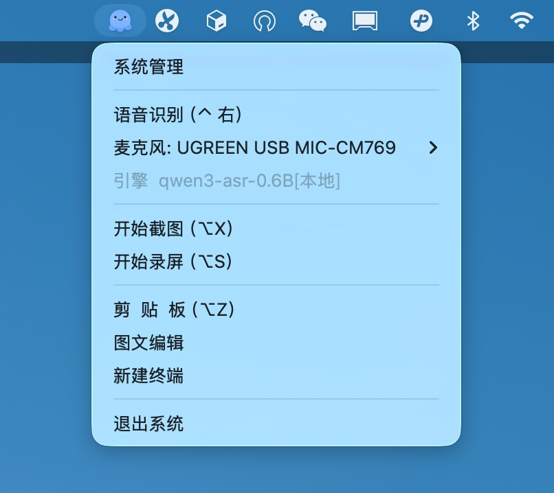
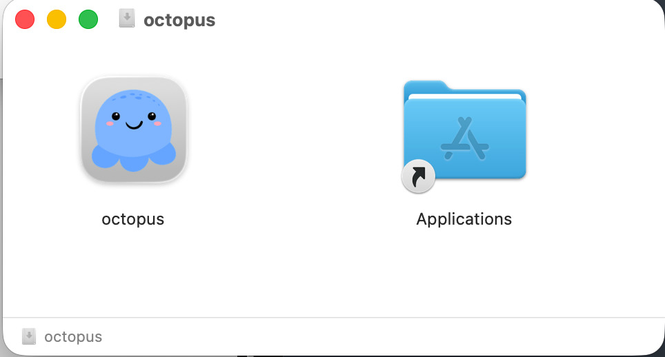

# octopus 使用手册

> 面向最终用户的操作指南。本文档描述「怎么用」，不涉及内部实现。
> 技术细节请参考 [`docs/features/`](../features/) 与 [`docs/architecture.md`](../architecture.md)。

octopus 是一款 macOS 桌面效率工具，把**语音听写、截图标注、屏幕录制、OCR、剪贴板、翻译、密码管理、命令面板、终端**九大能力整合到一个常驻后台的应用里，用全局快捷键随时唤起，不打断你当前的工作流。

核心理念：**你不用切换到 octopus，octopus 随时在你的指尖**。



---

## 九大功能模块

| 模块 | 一句话简介 | 默认快捷键 | 详见 |
|------|-----------|-----------|------|
| 🎙️ **语音识别 / 听写** | 按住说话即转文字，停止自动粘贴到光标处；可实时编辑、润色 | 右 `⌥` | [asr-dictation.md](./asr-dictation.md) |
| 🖼️ **截图与标注** | 区域截图、滚动长截图、丰富的标注工具、贴图浮窗 | `⌘⇧X` | [screenshot.md](./screenshot.md) |
| 🎬 **屏幕录制** | 录制全屏 / 窗口 / 区域，支持实时标注、双音轨、GIF、自动字幕 | `⌘⇧R` | [screen-recording.md](./screen-recording.md) |
| 🔤 **OCR 文字识别** | 截图 / 图片 / 剪贴板图片转文字，支持二维码识别 | —（随截图/预览触发）| [ocr.md](./ocr.md) |
| 📋 **剪贴板历史** | 记录文本 / 图片 / 语音 / 文件，全文搜索，粘贴队列 | `⌥C` | [clipboard.md](./clipboard.md) |
| 🌐 **翻译** | 语音结果、截图、选中文本的即时翻译，本地 + 云端引擎 | —（各入口触发）| [translate.md](./translate.md) |
| 🔐 **密码保险箱** | AES-256 加密存储，Auto-Type 自动填充防钓鱼，TOTP，密码生成器 | `⌘⇧S`（Auto-Type）| [vault.md](./vault.md) |
| ⌘ **Action Bar 命令面板** | 类 Alfred/Raycast 的快捷启动器：搜应用/文件/书签、计算、执行命令、召唤 AI | `⌥D` | [action-bar.md](./action-bar.md) |
| 💻 **终端** | 内嵌终端（xterm.js + 系统 shell），多标签、文件树、AI agent 联动 | —（托盘/Action Bar）| [terminal.md](./terminal.md) |

> 下载器（分块下载、视频音频下载转码）和图文编辑器（多标签文本/图片/语音编辑）是贯穿上述模块的工具，不作为独立模块单列。

---

## 系统要求

| 平台 | 支持情况 |
|------|---------|
| **macOS** | ✅ 全功能支持（推荐，主要测试平台）|
| Windows / Linux | ⚠️ 部分功能支持。**屏幕录制仅 macOS**；终端、剪贴板、截图等跨平台可用 |

- macOS 12+（基于 ScreenCaptureKit 等系统框架）
- 建议至少 8 GB 内存（本地 AI 模型推理需要）

---

## 安装

### 方式一：DMG 安装包（推荐）

1. 获取 `octopus_<版本>_<架构>.dmg` 文件。
2. 双击打开，把 **octopus.app** 拖到「应用程序」文件夹。
3. 首次打开若提示「无法验证开发者」：打开「系统设置 → 隐私与安全性 → 仍要打开」放行（应用未签名，仅自用 / 内测）。



### 方式二：从源码构建

需要 Rust 工具链 + Node.js。生产构建：

```bash
# 构建并运行桌面应用（含本地 ASR + 云端 + 密码箱，生产优化）
cargo run --profile optimize -p octopus-desktop --features embedded,cloud,vault,custom-protocol
```

打包成 DMG：

```bash
./scripts/build-macos-dmg.sh
```

详见根目录 [usage.md](../../usage.md) 的编译说明。

---

## 首次启动：权限引导

首次打开 octopus 会弹出引导页，按提示逐项授权（macOS 安全机制要求）。**这三项权限是核心功能的前提**：

| 权限 | 用途 | 不授权的后果 |
|------|------|-------------|
| 🎤 **麦克风** | 语音识别、录屏录音 | 说话不识别、录制无声 |
| ♿ **辅助功能（Accessibility）** | 模拟键盘粘贴、Auto-Type 填密码、窗口焦点控制 | 识别结果无法粘贴、密码无法自动填充 |
| 🖥️ **屏幕录制** | 截图、屏幕录制 | 截图 / 录屏返回黑屏 |

授权步骤：在引导页点「申请权限」→ 跳转到系统设置 → 开启 octopus 的开关 → **回到应用点「刷新状态」**。

> ⚠️ **升级应用后权限可能失效**：由于应用未签名，每次升级到新版本，权限列表里的旧条目会变灰。需要先点 `−` 删除旧条目，再点 `+` 重新添加新版本，然后**重启应用**才生效。

> 📷 **待补截图**（`images/onboarding-permissions.png`）：首次启动的权限引导页

---

## 全局快捷键速查表

所有快捷键均可在「设置 → 快捷键卡片」中自定义，改完立即生效（热重载）。

| 功能 | 默认快捷键 | 说明 |
|------|-----------|------|
| 语音识别 / 听写 | **右 `⌥`**（右 Option 键）| 单键三模式：长按 / 双击 / 短按 |
| 语音结果窗 · 编辑（窗口内）| `⌘↵` | 在结果窗口内切换编辑 |
| 语音结果窗 · 编辑（全局唤起）| `⌥E` | 任意应用下唤起结果窗并编辑 |
| Action Bar 命令面板 | `⌥D` | 弹出快捷启动器 |
| 剪贴板历史 | `⌥C` | 打开剪贴板浮窗 |
| 粘贴队列 · 出栈粘贴 | `⌘⇧V` | 逐条弹出队列内容粘贴 |
| 截图 | `⌘⇧X` | 开始区域截图 |
| 屏幕录制（开始 / 暂停）| `⌘⇧R` | toggle，仅 macOS |
| 停止录屏 | `⎋` | 固定，不可改 |
| 密码箱 · Auto-Type 填充 | `⌘⇧S` | 在登录页自动填充账号密码 |
| 取消语音录音 | `⎋` | 固定，丢弃本次内容 |

> 快捷键符号对照：`⌘` Cmd · `⇧` Shift · `⌥` Option/Alt · `⌃` Control · `⎋` Esc · `↵` Enter/回车

---

## 设置入口

几乎所有配置都在**设置窗口**里完成。打开方式：

- **托盘菜单 → 设置**（菜单第一项）
- 或各功能浮窗里的「⚙️ 设置」按钮

设置窗口左侧是导航栏，分功能模块组织：

> 📷 **待补截图**（`images/settings-nav.png`）：设置窗口左侧导航栏全貌

| 导航项 | 配置内容 |
|--------|---------|
| **设置** | 首页分 7 张卡片：外观（界面语言）/ 交互（麦克风、降噪、工具栏显隐、剪贴板监听）/ 剪贴板（条数、清理、主题）/ 快捷键 / 语音识别（语言、硬件加速、纠错、简繁、停顿）/ 语音识别润色（模式、提示词、间隔）/ 终端字体；另有「Git 同步」子标签 |
| **模型管理** | 语音识别 / 文本模型 / 扫描识别（OCR）/ 翻译 四类模型的下载、激活、云端 API Key 配置 |
| **命令面板** | Action Bar 菜单动作的增删改、Quick Execute 快捷键 |
| **剪贴板** | 剪贴板历史的完整管理视图（筛选、搜索、批量删除） |
| **录屏管理** | 录制列表、导出 GIF、合并音轨、转字幕 |
| **热词** | 拼音纠错开关、方言模糊规则、热词词典版本管理 |
| **提示词** | 润色提示词模板管理（内置 3 个可编辑，可自定义） |
| **智能体** | 外部 AI Agent（Pi / Claude Code 等）路径配置 |
| **密码保险库** | 条目管理、健康检查、导入导出、自动锁定 |
| **系统状态** | 实时进程内存 / CPU、各模型内存占用、趋势图 |

---

## 数据存储位置

octopus 的所有数据集中在一个目录，方便备份：

```
~/.octopus/
├── octopus.db          # 唯一数据库（配置 / 历史 / 密码箱 / 热词 / 录屏记录）
├── config.yaml         # 应用配置（缺失用默认值）
├── .sync/              # 跨设备同步仓库（可选）
└── models/             # AI 模型文件
```

录屏文件默认存在 `~/Documents/octopus/recordings/`，截图原图存在 `~/Documents/octopus/screens/`（均可在设置中改）。

---

## 常见问题

**Q：应用启动后什么都不显示？**
A：octopus 是常驻后台应用，没有主窗口。所有功能通过**托盘图标**或**全局快捷键**唤起。看屏幕右上角（macOS 菜单栏）的托盘图标。

**Q：语音识别按了快捷键没反应？**
A：检查 ① 麦克风权限是否授予；② 托盘菜单「语音识别」是否显示快捷键；③ 是否选对了麦克风（托盘菜单有麦克风子菜单可快速切换）。

**Q：识别结果不自动粘贴？**
A：检查「辅助功能」权限是否授予——这是模拟键盘粘贴的必要权限。授权后需**重启应用**。

**Q：怎么切换语音识别引擎 / 翻译引擎 / OCR 引擎？**
A：统一在「设置 → 模型管理」里操作。每个域（语音 / 文本 / OCR / 翻译）只能激活一个模型，点「激活」即可。

**Q：忘记密码箱主密码怎么办？**
A：**无法找回**。主密码是加密密钥的派生来源，遗忘后保险库数据无法解密。请务必妥善保管，或使用 Git 同步在另一台设备保留可访问副本。

---

## 关于本手册

- 本手册的截图位置用 `📷 待补截图` 标记，后续逐步补充到 `docs/usage/images/` 目录。
- 快捷键默认值以应用代码（`crates/infra/src/config.rs`）为准；若与实际不符，可在设置中查看 / 修改。
- 功能行为以 [`docs/features/`](../features/) 为准；本手册是操作层摘要。
