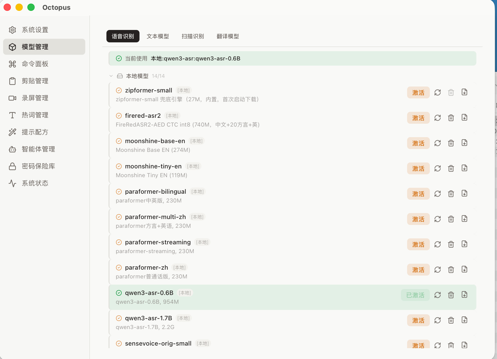
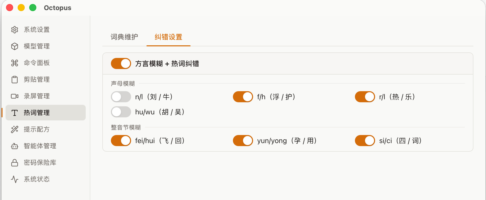
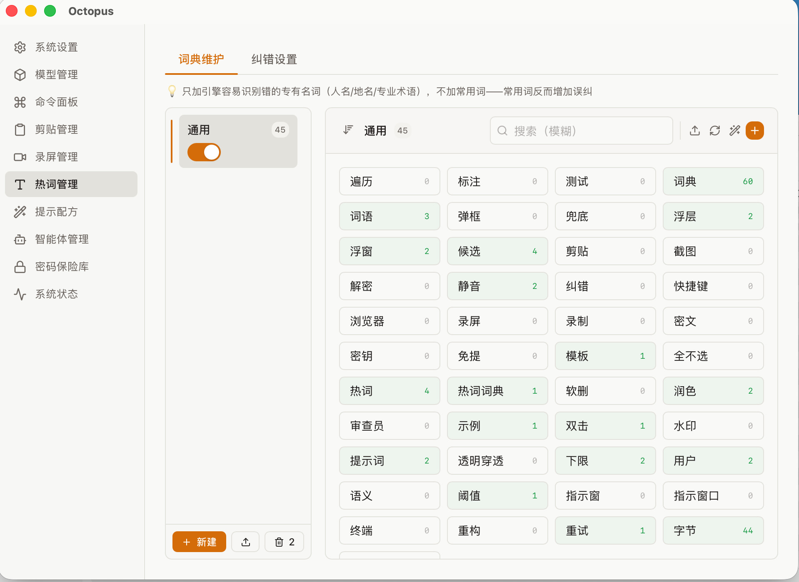

# 语音识别 / 听写

> 把说的话实时转成文字，停止后自动粘贴到光标位置。支持边说边编辑、选中替换、LLM 润色。

octopus 的语音识别是它的核心能力。按一下键就能在任何应用里听写——写邮件、填表、记笔记、聊天，无需切换输入法，无需打开专门窗口。

---

## 快速开始

最简单的用法，三步：

1. 把光标点到你想输入文字的地方（任意应用：备忘录、微信、浏览器输入框……）。
2. **按住右 `⌥` 键**（右 Option 键）开始说话。
3. **松开**，识别结果自动粘贴到光标处。

就这么简单。这是「长按模式」——按住说话、松开粘贴，像对讲机一样。

---

## 三种触发模式（同一个键）

octopus 用**一个键**（默认右 `⌥`）支持三种使用方式，靠你按键的节奏自动区分：

| 模式 | 怎么触发 | 适合场景 | 表现 |
|------|---------|---------|------|
| **长按（对讲机）** | 按住不放 → 说话 → 松开 | 短句、指令 | 松开即停止并粘贴 |
| **双击（免提）** | 快速双击开始 → 再双击停止 | 较长的独白、口述 | 屏幕底部出现指示卡，期间持续识别 |
| **短按（可编辑）** | 短按一下开始 → 再短按停止 | 需要边说边改的内容 | 顶部弹出可编辑的结果窗口 |

> 不习惯右 `⌥`？在「设置 → 快捷键卡片」里可以改成右 `⌘` / 右 `⌃` / 右 `⇧` / `Fn`。

> 📷 **待补截图**（`images/asr-three-modes.png`）：三种模式的视觉表现对比（对讲机/底部指示卡/顶部编辑窗）

---

## 识别结果窗口

短按模式下，屏幕顶部会弹出一个**透明置顶的结果窗口**，随说随显示文字。

### 工具栏

鼠标移到窗口上会展开工具栏：

> 📷 **待补截图**（`images/asr-toolbar.png`）：结果窗口工具栏展开状态

| 按钮 | 作用 |
|------|------|
| ✕ 关闭（首位） | 放弃本次内容（但保留在历史里）|
| 降噪模式 | 运行时切换：无 / 轻度 / 深度 |
| 润色模式 | 运行时切换：关 / 仅最终 / 中间+最终 |
| ✨ 立即润色 | 马上调 LLM 润色当前文本（忽略润色设置）|
| 翻译 | 打开 / 关闭双语翻译视图（原文 + 译文上下分栏）|
| 立即翻译 | 手动档立即重翻一次 |
| 放大 / 缩小 | 精简小条 ↔ 完整大窗切换 |
| 保存 | 提交你修改的文字并恢复 ASR（与 `⌘↵` 同语义）|

### 边说边编辑

识别过程中随时可以编辑文字，**不必等说完**：

- 按 `⌘↵`（窗口内）或 `⌥E`（任意应用下唤起）进入编辑。
- 编辑期间录音**自动暂停**，改完恢复后会接着识别（不会因为你打字慢而丢字）。
- 改动后空闲 2 秒自动保存你修改的部分。

### 选中替换（核心特色）

这是 octopus 最实用的功能之一：**在结果窗口里选中一段文字，然后继续说话——新语音会替换掉选中的内容**。

- 选错了一句话？选中它，重说一遍就行。
- 想在中间插入？点一下把光标定位到中间，新文字会从那里开始生长。

### 复制与粘贴

停止识别后默认**自动粘贴**到前台应用（模拟 `⌘V`）。相关行为在「设置 → 交互卡片」配置：

| 设置项 | 默认 | 作用 |
|--------|:----:|------|
| 粘贴方式 | 剪贴板 | 模拟 Cmd+V 粘贴 |
| 粘贴后写入剪贴板 | 开 | 粘贴后同时存入剪贴板，方便复用 |
| 粘贴前切英文键盘 | 开（仅 macOS）| 粘贴前临时切到 ABC 输入法，避免中文输入法干扰 |

> 💡 如果识别结果不自动粘贴，多半是没授予**辅助功能权限**（模拟键盘需要）。去「系统设置 → 隐私与安全性 → 辅助功能」开启 octopus，然后**重启应用**。

---

## 识别引擎

octopus 支持本地和云端两类引擎，按需切换。

### 本地引擎（推荐，离线可用）

| 引擎 | 特点 |
|------|------|
| **SenseVoice** | 快速，自动检测语言，支持中英粤日韩（默认推荐）|
| **Whisper** | 多语言，英文场景质量好（`.en` 版最佳）|
| **Paraformer** | 中文优化，支持流式 |
| **Qwen3-ASR** | 大模型能力，质量高（0.6B / 1.7B）|
| **Zipformer** | 轻量级，启动快，是内置兜底引擎 |
| **FireRed** | 中文 + 20 种方言 + 英文 |
| **Moonshine** | 英语轻量引擎 |

### 云端引擎（需联网 + API Key）

阿里云 DashScope、字节火山豆包、腾讯云、百度智能云。云端引擎识别质量通常更高，但需要配置 API Key，且应用需以云端功能编译。

> ⚠️ 云端引擎需要应用启用 `cloud` 功能编译；API Key 目前部分需要在设置页填，部分需手动配置。

### 怎么切换引擎

1. 打开「设置 → 模型管理」。
2. 顶部切到「**语音识别**」标签。
3. 找到想用的引擎：本地引擎点「下载」（首次）→「激活」；云端引擎点「添加模型」填鉴权信息（API Key 等）后「激活」。
4. **下一次录音生效**。

> 💡 每个域（语音 / 文本 / OCR / 翻译）同一时间只能激活一个引擎。托盘菜单的「引擎信息」会显示当前激活的引擎。

> 没激活任何引擎？octopus 会自动回退到内置的 `zipformer-small`，首次启动时自动下载，保证开箱即用。

---

## 热词：让识别更懂你的专有名词

当引擎老是把某些词识别错（人名、地名、专业术语、公司名），用**热词**纠正它。

### 入口

「设置 → 热词」，包含两个标签：

### 1. 纠错设置

- **拼音纠错总开关**（默认开）：开启后对识别结果做拼音映射纠错。
- **方言模糊规则**：如果你有口音，可以打开对应的模糊规则（如 `n/l` 不分、`f/h` 不分、`yun/yong` 混淆等）。

### 2. 词典维护

- **版本（场景）管理**：可以建多个热词版本（如「工作」「日常」），多个版本可同时启用，词语叠加生效。
- **添加词语**：点 `+` 批量粘贴，按空白分隔。
- **挖掘**：用 AI 从你的历史识别记录里挖掘候选专有名词，确认后入库。
- **搜索**：支持汉字和拼音首字母搜索（输入 `bzy` 能找到「八爪鱼」）。

> ⚠️ **重要原则：只加引擎容易识别错的专有名词**（人名、地名、术语），**不要加常用词**——常用词反而可能增加误纠。

---

## LLM 润色

说完的话可以自动让大语言模型润色——纠错别字、整理口语、优化表达。

### 怎么开启

「设置 → 语音识别润色卡片 → 润色模式」：

| 模式 | 行为 |
|------|------|
| **关闭**（默认）| 不润色，直接输出原始识别结果 |
| **仅最终润色** | 停止录音后润色一次再粘贴 |
| **中间 + 最终润色** | 说话停顿时也会触发润色，实时优化 |

### 手动润色

无论润色模式设成什么，结果窗口工具栏的「✨ 立即润色」按钮都能随时触发一次润色。

### 润色用哪个模型

润色走**文本模型**（和识别引擎分开）。在「设置 → 模型管理 → 文本模型」点「**添加模型**」——选服务商（DeepSeek / 智谱 / 阿里 / OpenAI / Kimi / MiniMax，选了自动填 API 地址）→ 填模型名和 API Key →「激活」。

### 润色风格

「设置 → 语音识别润色卡片 → 润色提示词」可选择不同风格：

- **忠实校对**：只纠错，不改意思（默认）
- **意图整理**：清洗口语噪声，结构化输出
- **口语化**：保留口语风味，适度整理

也可以在「模型管理」旁的提示词管理页自定义。

---

## 设置项详解

语音相关设置分布在设置首页的两张卡片——「语音识别」和「语音识别润色」（外加「交互」卡片里的麦克风 / 降噪）：

### 语音识别 / 语音识别润色卡片

| 设置项 | 默认 | 作用 |
|--------|:----:|------|
| 识别语言 | 自动 | `自动` 由引擎检测；**中文场景建议固定选「中文」**，避免短音频误判 |
| 硬件加速 | 关 | 开启 GPU / CoreML 加速，失败自动回退 CPU |
| 简繁输出 | 简体 | 繁体输出会自动转简（可关）|
| 句间停顿（VAD 分段）| 400ms | 停顿超过此时长即切句识别，下拉 300–600ms |
| 润色模式 | 关闭 | 见上文 |
| 润色提示词 | 忠实校对 | 见上文 |
| 润色间隔 | 5.0s | 中间润色的触发间隔 |
| 润色停顿阈值 | 600ms | 静音超过此时长触发中间润色 |

### 交互卡片（相关项）

| 设置项 | 默认 | 作用 |
|--------|:----:|------|
| 麦克风 | 系统默认 | 选录音设备（也可在托盘菜单的麦克风子菜单快速切换）|
| 降噪模式 | 轻度（RNNoise）| `无` 直通 / `轻度` RNNoise / `深度` DeepFilterNet3（质量最佳）|
| 工具栏自动隐藏 | 关 | 默认工具栏常显；开启后鼠标移开隐藏、移入显示 |

---

## 快捷键速查

| 快捷键 | 默认 | 作用 |
|--------|:----:|------|
| 开始 / 停止录音 | 右 `⌥` | 单键三模式（长按 / 双击 / 短按）|
| 编辑（窗口内）| `⌘↵` | 切换结果窗编辑模式 |
| 编辑（全局唤起）| `⌥E` | 任意应用下唤起结果窗并编辑 |
| 取消录音 | `⎋` | 丢弃本次内容 |

---

## 常见问题

**Q：按了快捷键没反应？**
检查：① 麦克风权限（系统设置 → 隐私与安全性 → 麦克风）；② 托盘菜单「语音识别」是否显示快捷键；③ 麦克风设备是否选对（托盘菜单有麦克风子菜单）。

**Q：识别结果不自动粘贴？**
需要「辅助功能」权限（模拟键盘粘贴的前提）。授权后**必须重启应用**才生效。

**Q：说中文偶尔蹦出日文 / 繁体？**
「自动」语言检测对短音频不准。去「设置 → 语音识别卡片」把识别语言**固定为「中文」**。

**Q：录着录着突然没反应了？**
音频采集偶尔会断，octopus 有看门狗会在 3 秒内自动重连，期间的文字会拼在一起，通常无需干预。

**Q：怎么让识别更准？**
① 加热词（专有名词）；② 开降噪（嘈杂环境）；③ 固定识别语言；④ 用更好的引擎（如 Qwen3-ASR 或云端引擎）。

**Q：硬件加速要不要开？**
开了能提速，但 Qwen3-ASR 在 macOS 上开 CoreML 反而更慢（会自动跳过）。开错了不用担心，失败会自动回退 CPU，不会崩溃。

---

← 返回 [使用手册总纲](./README.md)
